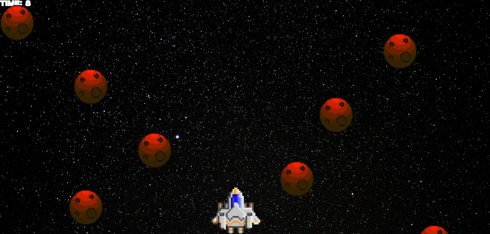

# A web space shooter game

this project is based on vanilla js and is my first project after learning js

## Main menu

## Game process

## Music from game

- menu ambient: \
  Aura by Alex-Productions | https://onsound.eu/ \
  Music promoted by https://www.chosic.com/free-music/all/ \
  Creative Commons CC BY 3.0 \
  https://creativecommons.org/licenses/by/3.0/

- game ambient: \
  generated by suno ai \
  https://suno.com/song/d75d20f6-5c82-4b49-88ac-b7158665eb83?sh=Phwp7BadmLaALmC5

## special thanks

### The JS course I took ()

- Author: https://www.youtube.com/@freedomdeveloper
- Course playlist: https://www.youtube.com/watch?v=0tYPZz0Los4&list=PLxRHZLooZclnxkIl0OyWCV0xBJAjj1_Rx
